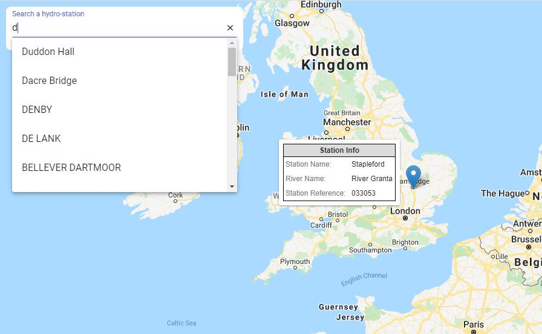

# UKHydro

This project was generated with [Angular CLI](https://github.com/angular/angular-cli) version 9.1.0, Leaflet 1.6.0, and Angular Material 9.2.0. This project is a simple web-GIS application to search hydrometric stations across UK.

## Defra DataSource API

In this projetc I have used [Defra](https://environment.data.gov.uk/) Data Services Platform for real-time hydrometric stations data. Defra group have put in place the Data Services Platform to make environmental data openly available to a wide range of users.

## App Preview Shot

